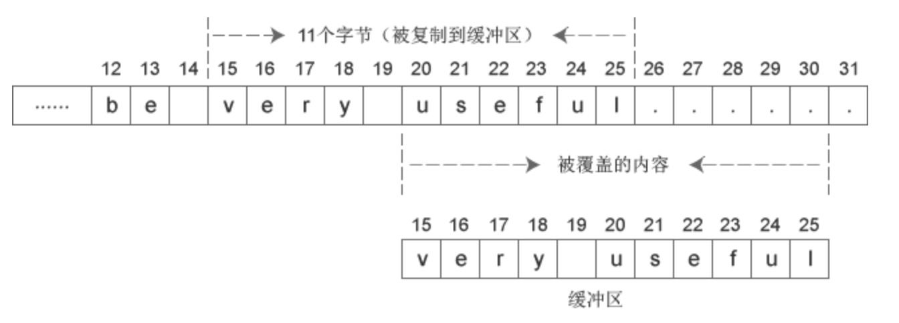

# ziplist

http://redisbook.readthedocs.io/en/latest/compress-datastruct/ziplist.html

## 依然insert

### 字节取位

多字节数有时候需要取其中的某几位，比如高8位，低8位。例如：

buf[1] = (rawlen >> 24) & 0xFF;

4字节数取高8位，右移24位再与0xFF，再隐式转换为单字节char。

实际上不需要与0xFF，隐式转换时会自动将高位截取掉，即使高位不是0。


### nextdiff

新插入了entry，下一个entry之前保存的prev_entry_len可能会改变，改变的值就是nextdiff

```c
/* When the insert position is not equal to the tail, we need to
     * make sure that the next entry can hold this entry's length in
     * its prevlen field. */
    int forcelarge = 0;
    nextdiff = (p[0] != ZIP_END) ? zipPrevLenByteDiff(p,reqlen) : 0;
    if (nextdiff == -4 && reqlen < 4) {
        nextdiff = 0;
        forcelarge = 1;
    }
```
    
然而，这里的if不会进去。prev_entry_len由5变为1时，nextdiff=-4，这时前一个entry长度至少5字节，那么插入的entry的reqlen必然至少5字节，不会小于4。

### memmove
新插入entry，该entry后面的部分要整体向后移。这里使用memmove实现。

 void * memmove(void *dest, const void *src, size_t num);




```c
/* Store offset because a realloc may change the address of zl. */
    offset = p-zl;
    zl = ziplistResize(zl,curlen+reqlen+nextdiff);
    p = zl+offset;

    /* Apply memory move when necessary and update tail offset. */
    if (p[0] != ZIP_END) {
        /* Subtract one because of the ZIP_END bytes */
        memmove(p+reqlen,p-nextdiff,curlen-offset-1+nextdiff);

```

为什么不使用memcpy？

memcpy与memmove的目的都是将N个字节的源内存地址的内容拷贝到目标内存地址中。

但当源内存和目标内存存在重叠时，memcpy会出现错误，而memmove能正确地实施拷贝，但这也增加了一点点开销。

