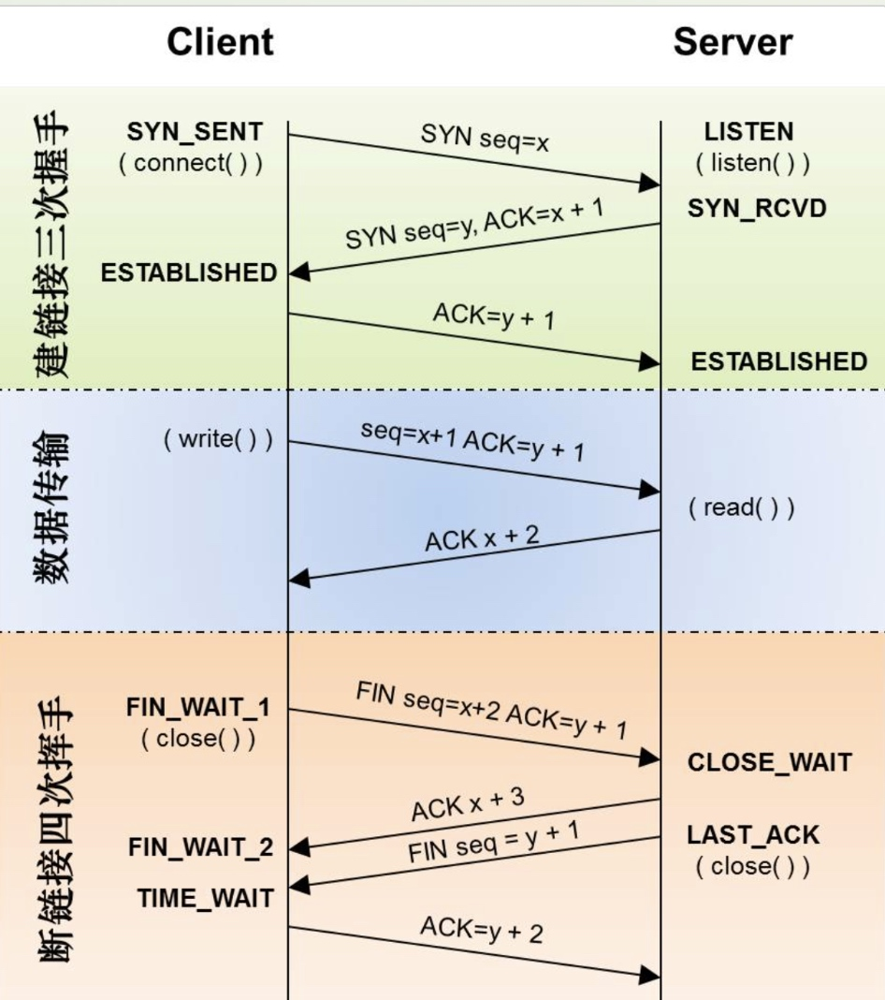
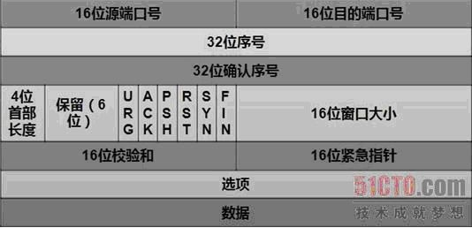
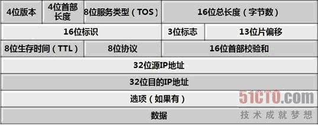
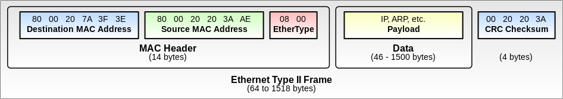
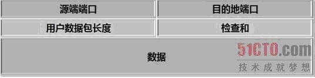

# 网络协议基础
TCP 三次握手、四次挥手、数据传输


类比寄信过程


TCP header 源码定义，共20字节
```c
/*TCP头定义，共20个字节*/
typedef struct _TCP_HEADER 
{
 short m_sSourPort;        　　　　　　// 源端口号16bit
 short m_sDestPort;       　　　　　　 // 目的端口号16bit
 unsigned int m_uiSequNum;       　　// 序列号32bit
 unsigned int m_uiAcknowledgeNum;  // 确认号32bit
 short m_sHeaderLenAndFlag;      　　// 前4位：TCP头长度；中6位：保留；后6位：标志位
 short m_sWindowSize;       　　　　　// 窗口大小16bit
 short m_sCheckSum;        　　　　　 // 检验和16bit
 short m_surgentPointer;      　　　　 // 紧急数据偏移量16bit
}__attribute__((packed))TCP_HEADER, *PTCP_HEADER;
```
TCP header 释义图


IP header 源码定义，共20字节
```c
/*IP头定义，共20个字节*/
typedef struct _IP_HEADER 
{
 char m_cVersionAndHeaderLen;     　　//版本信息(前4位)，头长度(后4位)
 char m_cTypeOfService;      　　　　　 // 服务类型8位
 short m_sTotalLenOfPacket;    　　　　//数据包长度
 short m_sPacketID;      　　　　　　　 //数据包标识
 short m_sSliceinfo;      　　　　　　　  //分片使用
 char m_cTTL;        　　　　　　　　　　//存活时间
 char m_cTypeOfProtocol;    　　　　　 //协议类型
 short m_sCheckSum;      　　　　　　 //校验和
 unsigned int m_uiSourIp;     　　　　　//源ip
 unsigned int m_uiDestIp;     　　　　　//目的ip
} __attribute__((packed))IP_HEADER, *PIP_HEADER ;
```
IP header 释义图


MAC header 释义图（共14字节）


UDP header 源码定义 共8字节
```c
/*UDP头定义，共8个字节*/
typedef struct _UDP_HEADER 
{
 unsigned short m_usSourPort;    　　　// 源端口号16bit
 unsigned short m_usDestPort;    　　　// 目的端口号16bit
 unsigned short m_usLength;    　　　　// 数据包长度16bit
 unsigned short m_usCheckSum;    　　// 校验和16bit
}__attribute__((packed))UDP_HEADER, *PUDP_HEADER;
```

UDP header 释义图

