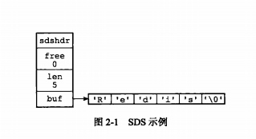
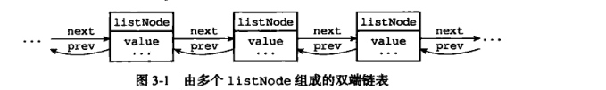
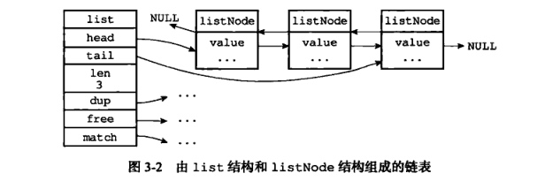
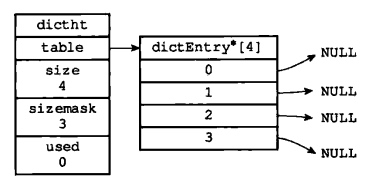
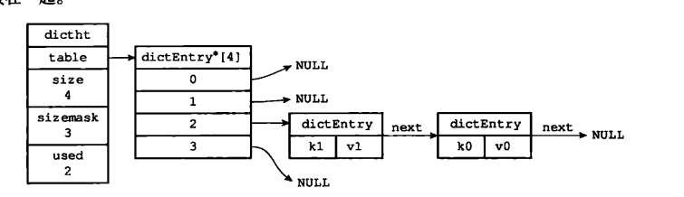
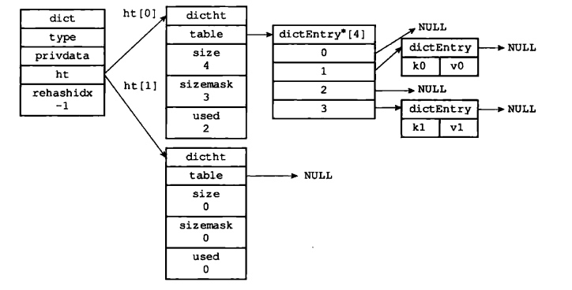
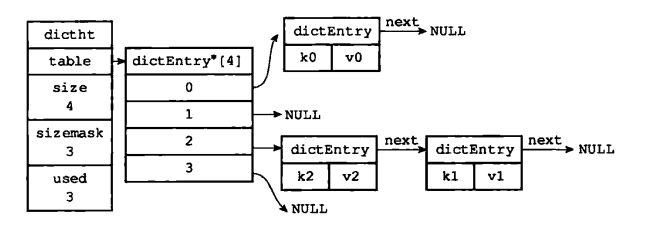

title: Redis数据结构（一）
date: 2018-07-18 15:14:03
tags:
---
# Redis底层数据结构
* sds 简单动态字符串（simple dynamic string）
* list 链表
* dict 字典
* skiplist 跳跃表
* intset 整数集合
* ziplist 压缩列表
* object 对象

### sds
区别于C语言的string，简单动态字符串结构耗空间多一些，存入一些字符串的元数据，在获取字符串长度时效率更高。在数据扩展和收缩时可以有效避免内存溢出，并减少内存重新分配次数。
```
/*  
 * 保存字符串对象的结构  
 */  
struct sdshdr {  
      
    // buf 中已占用空间的长度  
    int len;  
  
    // buf 中剩余可用空间的长度  
    int free;  
  
    // 数据空间  
    char buf[];  
};  
```


### list
此处的链表是双向链表，链表的每个节点使用listNode结构存储。
```
typedef struct listNode{
      struct listNode *prev;
      struct listNode * next;
      void * value;  
}
```

```
typedef struct list{
    //表头节点
    listNode  * head;
    //表尾节点
    listNode  * tail;
    //链表长度
    unsigned long len;
    //节点值复制函数
    void *(*dup) (void *ptr);
    //节点值释放函数
    void (*free) (void *ptr);
    //节点值对比函数
    int (*match)(void *ptr, void *key);
}
```


* 双端：链表节点带有prev 和next 指针，获取某个节点的前置节点和后置节点的时间复杂度都是O(1)
* 无环：表头节点的 prev 指针和表尾节点的next 都指向NULL，对立案表的访问时以NULL为截止
* 表头和表尾：因为链表带有head指针和tail 指针，程序获取链表头结点和尾节点的时间复杂度为O(1)
* 长度计数器：链表中存有记录链表长度的属性 len
* 多态：链表节点使用 void* 指针来保存节点值，并且可以通过list 结构的dup 、 free、 match三个属性为节点值设置类型特定函数。

### dict
用于保存键值对，类似于map（C语言中没有提供），使用hash表实现。
```
typedef struct dictht {
   //哈希表数组
   dictEntry **table;
   //哈希表大小
   unsigned long size;

   //哈希表大小掩码，用于计算索引值
   unsigned long sizemask;
   //该哈希表已有节点的数量
   unsigned long used;
}
```


dictEnty即是哈希表节点，采用的**链地址法**处理hash冲突
```
typeof struct dictEntry{
   //键
   void *key;
   //值
   union{
      void *val;
      uint64_tu64;
      int64_ts64;
   }
   struct dictEntry *next;

}
```


回到字典，是一个包含两个哈希表(第二个为空白哈希表，在rehash时用到)和额外数据的结构

```
typedef struct dict {
    // 类型特定函数
    dictType *type;
    // 私有数据
    void *privedata;
    // 哈希表
    dictht  ht[2];
    // rehash 索引
    in trehashidx;

}
```


解决hash冲突，链地址法是用插入链表节点的方式实现的，插入时要选择表头插入，是因为哈希表节点中没有记录链表尾节点位置。


rehash的步骤：
* 为ht[1]分配*第一个大于等于ht[0]的2的n次幂大小*的空间
* 将ht[0]数据转移到ht[1]，同时对数据重新进行哈希值计算
* 释放ht[0]，将ht[1]设置成ht[0]，为ht[1]分配空白哈希表

大部分情况下，rehash是渐进式进行的，同时维护一个索引计数器变量rehashidx，这可以避免集中式 rehash 带来的庞大计算量。