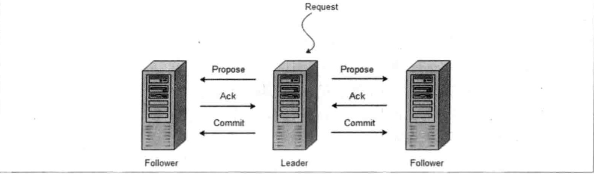

# zookeeper

A会议室，主讲人：谭淼

zookeeper是为了解决分布式一致性的一种方案

何为分布式一致性？简单来说是在分布式系统中保证数据的一致。这需要进行一系列数据复制写入，为了保证一致，可以将写入的动作阻塞，直到数据复制完成后，才执行写入动作。

但是这样又引入了数据性能这个新问题，怎样既保证数据一致性，又不影响系统运行的性能呢？为了权衡两者，引入了一致性级别的概念。

* 强一致性。系统写入什么，读出来也是什么，用户体验好，实现起来对系统性能影响大。
* 弱一致性。系统在写入成功后，**不承诺**多久后数据能达到一致，**尽可能**保证在某个时间级别后（比如秒级别），数据达到一致性。
* 最终一致性。弱一致性的一个特例，系统会**保证在一定时间内**，能够达到数据一致的状态。

ZooKeeper是一个典型的分布式数据一致性解决方案，分布式应用程序可以基于它实现诸如数据发布/订阅、负载均衡、命名服务、分布式协调/通知、集群管理、Master选举、分布式锁和分布式队列等功能。

使用ZooKeeper，分布式程序可以通过一个共享的、树型结构的名字空间进行协调，这种名字空间就是ZooKeeper中最重要的数据模型，存于内存中，由一系列ZNode构成。

ZooKeeper的特点，没有沿用传统Master/Slaver概念，而是引入Leader、Flower、Observer角色。集群中机器会参与Leader选举过程，选举出的Leader为客户端提供读写操作，Flower和Observer提供读操作，Observer不参与选举。

写操作的策略是“过半写成功”，具体过程是：

这也就是ZAB协议定义的广播过程。