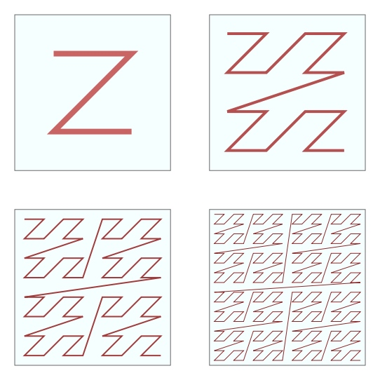
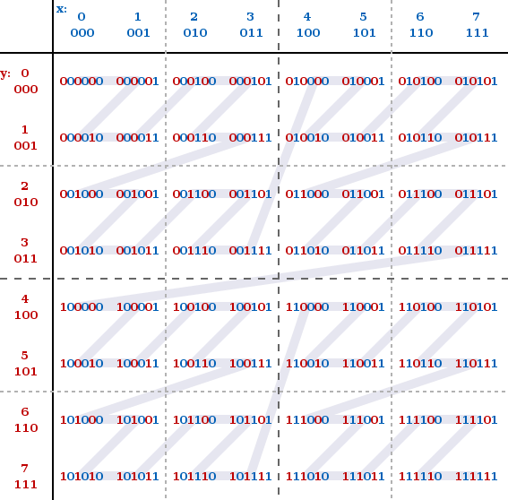

# geohash

Official Website：http://geohash.org/

## geohash是啥

geo => geography 将地理信息 hash

wiki：https://en.wikipedia.org/wiki/Geohash

一种公共地理信息编码系统，把经纬度地理信息编码后，最终以字符串形式使用

## geohash有啥用

The main usages of Geohashes are:

* As a unique identifier.
* To represent point data, e.g. in databases.

简单来说，geohash主要是把地理信息变成一个独特标识，能在数据库中标识坐标点数据。

经纬度（45.37, 121.7）就挺简洁的，为什么非要转成 c216ne 这样的字符串呢？一定是有好处的。

好处在于，使用地理数据时是在使用索引，**查询在一个索引远比查两个索引容易**。更厉害的是，**相似字符串表示的是相近的点**，这样，查找附近的目标点就更方便了。

本质上，geohash做的事情是把二维的经纬度坐标数据转化成了一维的字符串，这是一个降维过程。

## geohash啥原理

二维降一维很简单，按一定规则把两个数平到一起就行了。难的是，降维后，一维数据还保留了二维数据一定的连续性，这是非常有用的地方。二维平面上连成一片的那些点，降维成一维直线，它们竟还隔得很近。

这背后的原理是：Z-order curve。使用了数学上 Four iterations of the Z-order curve 的特性。

此图是一个二维平面，横纵坐标可以看做经纬度，中间是一条连续不断的线，从左上角开始，按「Z」型不断循环扩大画下去，充满整个平面。实际上这条线就是二维数据降维成一维的结果。画到多少呢？越密集，就表示数据的精度多高。

可见，线上大多数的相邻点在平面上也是相近的，除了一些边界处的点。

geohash的编码就是如此，横纵坐标分别是经纬度，将横纵坐标按一定精确度划分，再按规则合并到一起（规则：奇数位是横坐标，偶数位是纵坐标），恰好就是按整数从小到大排列的。

## geohash咋实现

将经纬度转换为Geohash大体可以分为三步曲：

* 将纬度(-90, 90)平均分成两个区间(-90, 0)、(0, 90)，如果坐标位置的纬度值在第一区间，则编码是0，否则编码为1。我们用 39.918118 举例，由于39.918118 属于 (0, 90)，所以编码为1，然后我们继续将(0, 90)分成(0, 45)、(45, 90)两个区间，而39.918118 位于(0, 45)，所以编码是0，依次类推，我们进行20次拆分，最后计算39.918118 的编码是 10111000110001011011；经度的处理也是类似，只是经度的范围是(-180, 180)，116.40382的编码是11010010110001101010
* 经纬度的编码合并，从0开始，奇数为是纬度，偶数为是经度，得到的编码是1110011101001000111100000011100111001101
* 对经纬度合并后的编码，进行base32编码，最终得到wx4g0ffe

看个例子的效果吧

| 地点   | 经纬度               | Geohash  |
| ------ | -------------------- | -------- |
| 鸟巢   | 116.402843,39.999375 | wx4g8c9v |
| 水立方 | 116.3967,39.99932    | wx4g89tk |
| 故宫   | 116.40382,39.918118  | wx4g0ffe |

## geohash怎么样

Z-order curve 是1966年发表，geohash算法是2008年公布。geohash的原理看起来异常简单，只是对 Z-order curve 的简单化用，而用处却很大，因为现在地图计算的场景太多了，时隔40年后互联网的发展推动了许多技术的应用。

geohash目前具体的应用情况不得而知，但很多实际的地图类产品应用的技术都是由geohash衍生而来，例如 Google 的 Google S2 技术，就是在geohash原理基础上使用了更加复杂的希尔伯特曲线代替 Z-order curve。猜测各家地图应用背后的技术也都类似，实现细节有差异，核心理念都是二维坐标数据降一维，以实现更高效的空间点索引，同时不免带来些边界点抖动。

明白了地图背后的技术原理，下次打车时就知道了，我都看见司机了，地图上却没有附近的车？没准只是因为恰好在边界点了。咋办，没事走两步~

***

参考：
* http://geohash.org/
* https://en.wikipedia.org/wiki/Geohash
* https://en.wikipedia.org/wiki/Z-order_curve
* https://github.com/GongDexing/Geohash
* https://halfrost.com/go_spatial_search/